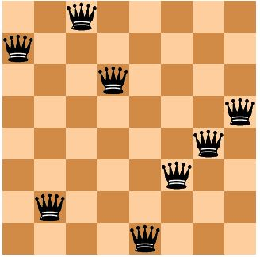
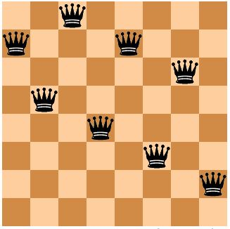
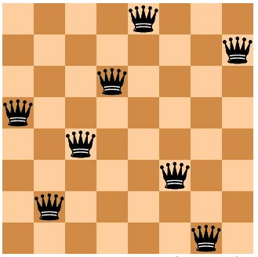

Tutorial - Getting Started
==========================
mlrose provides functionality for implementing some of the most popular randomization and search algorithms, and applying them to a range of different optimization problem domains. 

In this tutorial, we will discuss what is meant by an optimization problem and step through an example of how mlrose can be used to solve them. It is assumed that you have already installed mlrose on your computer. If not, you can do so using the instructions provided :ref:`here <install>`.

What is an Optimization Problem?
--------------------------------
An optimization problem is defined by Russell and Norvig (2010) as a problem in which "the aim is to find the best state according to an objective function." 

What is meant by a "state" depends on the context of the problem. Some examples of states are:

* the weights used in a machine learning model, such as a neural network;
* the placement of chess pieces on a chess board;
* the order that cities are visited in a tour of all cities on a map of a country;
* the colors selected to color the countries in a map of the world.

What is important, for our purposes, is that the state can be represented numerically, ideally as a one-dimensional array (or vector) of values. 

What is meant by "best" is defined by a mathematical formula or function (known as an objective function, fitness function, cost function or loss function), which we want to either maximize or minimize. The function accepts a state array as an input and returns a "fitness" value as an output. 

The output fitness values allow us to compare the inputted state to other states we might be considering. In this context, the elements of the state array can be thought of as the variables (or parameters) of the function.

Therefore, an optimization problem can be simply thought of as a mathematical function that we would like to maximize/minimize by selecting the optimal values for each of its parameters.

**Example**

The five-dimensional One-Max optimization problem involves finding the value of state vector :math:`x = [x_{0}, x_{1}, x_{2}, x_{3}, x_{4}]` which maximizes :math:`Fitness(x) = x_{0} + x_{1} + x_{2} + x_{3} + x_{4}`. 

If each of the elements of :math:`x` can only take the values 0 or 1, then the solution to this problem is :math:`x = [1, 1, 1, 1, 1]`. When :math:`x` is set equal to this optimal value, :math:`Fitness(x) = 5`, the maximum value it can take.

Why use Randomized Optimization?
--------------------------------
For the One-Max example given above, even if the solution was not immediately obvious, it would be possible to calculate the fitness value for all possible state vectors, :math:`x`, and then select the best of those vectors. However, for more complicated problems, this cannot always be done within a reasonable period of time. Randomized optimization overcomes this issue. 

Randomized optimization algorithms typically start at an initial "best" state vector (or population of multiple state vectors) and then randomly generate a new state vector (often a neighbor of the current "best" state). If the new state is better than the current "best" state, then the new vector becomes the new "best" state vector.

This process is repeated until it is no longer possible to find a better state vector than the current "best" state, or if a better state vector cannot be found within a pre-specified number of attempts. 

There is no guarantee a randomized optimization algorithm will find the optimal solution to a given optimization problem (for example, it is possible that the algorithm may find a local maximum of the fitness function, instead of the global maximum). However, if a sufficiently large number of attempts are made to find a better state at each step of the algorithm, then the algorithm will return a "good" solution to the problem. 

There is a trade-off between the time spent searching for the optimal solution to an optimization problem and the quality of the solution ultimately found.

Solving Optimization Problems with mlrose
-----------------------------------------
Solving an optimization problem using mlrose involves three simple steps:

1. Define a fitness function object.
2. Define an optimization problem object.
3. Select and run a randomized optimization algorithm.

To illustrate each of these steps, in the next few sections we will work through the example of the 8-Queens optimization problem, described below:

**Example: 8-Queens**

In chess, the queen is the most powerful piece on the board. It can attack any piece in the same row, column or diagonal. In the 8-Queens problem, you are given a chessboard with eight queens (and no other pieces) and the aim is to place the queens on the board so that none of them can attack each other (Russell and Norvig (2010). 

Clearly, in an optimal solution to this problem, there will be exactly one queen in each column. So, we only need to determine the row position of each queen, and we can define the state vector for this problem as :math:`x = [x_{0}, x_{1}, x_{2}, x_{3}, x_{4}, x_{5}, x_{6}, x_{7}]`, where :math:`x_{i}` denotes the row position of the queen in column i (for i = 0, 1, ..., 7).

The chessboard pictured below could, therefore, be described by the state vector :math:`x = [6, 1, 7, 5, 0, 2, 3, 4]`, where the bottom left corner of the chessboard is assumed to be in column 0 and row 0. 

This is not an optimal solution to the 8-Queens problem, since the three queens in columns 5, 6 and 7 are attacking each other diagonally, as are the queens in columns 2 and 6.

Before starting with this example, you will need to import the mlrose and Numpy Python packages.

.. highlight:: python
.. code-block:: python

	import mlrose
	import numpy as np
   
Define a Fitness Function Object
--------------------------------
The first step in solving any optimization problem is to define the fitness function. This is the function we would ultimately like to maximize or minimize, and which can be used to evaluate the fitness of a given state vector, :math:`x`.

In the context of the 8-Queens problem, our goal is to find a state vector for which no pairs of attacking queens exist. Therefore, we could define our fitness function as evaluating the number of pairs of attacking queens for a given state and try to minimize this function.

mlrose includes pre-defined fitness function classes for a range of common optimization problems, including the N-Queens family of problems (of which 8-Queens is a member). A list of the pre-defined fitness functions can be found :ref:`here <fitness>`. The pre-defined :code:`Queens()` class includes an implementation of the (8-)Queens fitness function described above.

We can initialize a fitness function object for this class, as follows:

.. highlight:: python
.. code-block:: python

	fitness = mlrose.Queens()
	
Alternatively, we could look at the 8-Queens problem as one where the aim is to find a state vector for which all pairs of queens do *not* attack each other. In this context, we could define our fitness function as evaluating the number of pairs of *non-attacking* queens for a given state and try to maximize this function.

This definition of the 8-Queens fitness function is different from that used by mlrose's pre-defined :code:`Queens()` class, so to use it, we will need to create a custom fitness function. This can be done by first defining a fitness function with a signature of the form :code:`fitness_fn(state, **kwargs)`, and then using mlrose's :code:`CustomFitness()` class to create a fitness function object, as follows:

.. highlight:: python
.. code-block:: python

   # Define alternative N-Queens fitness function for maximization problem
   def queens_max(state):
		
      # Initialize counter
	  fitness_cnt = 0
		
	     # For all pairs of queens
	     for i in range(len(state) - 1):
		    for j in range(i + 1, len(state)):
				
	           # Check for horizontal, diagonal-up and diagonal-down attacks
	           if (state[j] != state[i]) \
	               and (state[j] != state[i] + (j - i)) \
	               and (state[j] != state[i] - (j - i)):
					
	              # If no attacks, then increment counter
	              fitness_cnt += 1

	  return fitness_cnt
	
   # Initialize custom fitness function object
   fitness_cust = mlrose.CustomFitness(queens_max)

Define an Optimization Problem Object
-------------------------------------
Once we have created a fitness function object, we can use it as an input into an optimization problem object. In mlrose, optimization problem objects are used to contain all of the important information about the optimization problem we are trying to solve. mlrose provides classes for defining three types of optimization problem objects:

* :code:`DiscreteOpt()`: This is used to describe discrete-state optimization problems. A discrete-state optimization problem is one where each element of the state vector can only take on a discrete set of values. In mlrose, these values are assumed to be integers in the range 0 to (max_val - 1), where max_val is defined at initialization.

* :code:`ContinuousOpt()`: This is used to describe continuous-state optimization problems. Continuous-state optimization problems are similar to discrete-state optimization problems, except that each value in the state vector can take any value in the continuous range between min_val and max_val, as specified at initialization. 

* :code:`TSPOpt()`: This is used to describe travelling salesperson (or tour) optimization problems. Travelling salesperson optimization problems differ from the previous two problem types in that, we know the elements of the optimal state vector are the integers 0 to (n - 1), where n is the length of the state vector, and our goal is to find the optimal ordering of those integers. We provide a worked example of this problem type :ref:`here <tutorial2>`, so will not discuss it further for now.

The 8-Queens problem is an example of a discrete-state optimization problem, since each of the elements of the state vector must take on an integer value in the range 0 to 7. 

To initialize a discrete-state optimization problem object, it is necessary to specify the problem length (i.e. the length of the state vector, which is 8 in this case); max_val, as defined above (also 8); the fitness function object created in the previous step; and whether the problem is a maximization or minimization problem. 

For this example, we will use the first of the two fitness function objects defined above, so we want to solve a minimization problem. 

.. highlight:: python
.. code-block:: python

	problem = mlrose.DiscreteOpt(length = 8, fitness_fn = fitness, maximize = False, max_val = 8)
	
However, had we chosen to use the second (custom) fitness function object, we would be dealing with a maximization problem, so, in the above code, we would have to set the :code:`maximize` parameter to :code:`True` instead of :code:`False` (in addition to changing the value of the :code:`fitness_fn` parameter).

Select and Run a Randomized Optimization Algorithm
--------------------------------------------------
Now that we have defined an optimization problem object, we are ready to solve our optimization problem. mlrose includes implementations of the (random-restart) hill climbing, randomized hill climbing (also known as stochastic hill climbing), simulated annealing, genetic algorithm and MIMIC (Mutual-Information-Maximizing Input Clustering) randomized optimization algorithms (references to each of these algorithms can be found :ref:`here <algs>`). 

For discrete-state and travelling salesperson optimization problems, we can choose any of these algorithms. However, continuous-state problems are not supported in the case of MIMIC.

For our example, suppose we wish to use simulated annealing. To implement this algorithm, in addition to defining an optimization problem object, we must also define a schedule object (to specify how the simulated annealing temperature parameter changes over time); the number of attempts the algorithm should make to find a "better" state at each step (max_attempts); and the maximum number of iterations the algorithm should run for overall (max_iters). We can also specify the starting state for the algorithm, if desired (init_state).

To specify the schedule object, mlrose includes pre-defined decay schedule classes for geometric, arithmetic and expontential decay, as well as a class for defining your own decay schedule in a manner similar to the way in which we created a customized fitness function object. These classes are defined :ref:`here <decay>`.

Suppose we wish to use an exponential decay schedule (with default parameter settings); make at most 10 attempts to find a "better" state at each algorithm step; limit ourselves to at most 1000 iterations of the algorithm; and start at an initial state of :math:`x = [0, 1, 2, 3, 4, 5, 6, 7]`. This can be done using the following code. 

The algorithm returns the best state it can find, given the parameter values it has been provided, as well as the fitness value for that state.

.. highlight:: python
.. code-block:: python

   # Define decay schedule
   schedule = mlrose.ExpDecay()
   
   # Define initial state
   init_state = np.array([0, 1, 2, 3, 4, 5, 6, 7])
   
   # Set random seed
   np.random.seed(1)

   # Solve problem using simulated annealing        
   best_state, best_fitness = mlrose.simulated_annealing(problem, schedule = schedule, 
                                                         max_attempts = 10, max_iters = 1000,
                                                         init_state = init_state)
														 
   print(best_state)
   [6 4 7 3 6 2 5 1]
   
   print(best_fitness)
   2.0

Running this code gives us a good solution to the 8-Queens problem, but not the optimal solution. The solution found by the algorithm, is pictured below:

The solution state has a fitness value of 2, indicating there are still two pairs of attacking queens on the chessboard (the queens in columns 0 and 3; and the two queens in row 6). Ideally, we would like our solution to have a fitness value of 0.

We can try to improve on our solution by tuning the parameters of our algorithm. Any of the algorithm's parameters can be tuned. However, in this case, let's focus on tuning the max_attempts parameter only, and increase it from 10 to 100.

.. highlight:: python
.. code-block:: python

   # Set random seed
   np.random.seed(1)

   # Solve problem using simulated annealing        
   best_state, best_fitness = mlrose.simulated_annealing(problem, schedule = schedule,
                                                         max_attempts = 100, max_iters = 1000,
                                                         init_state = init_state)
														 
   print(best_state)
   [4 1 3 5 7 2 0 6]
   
   print(best_fitness)
   0.0

This time when we run our code, we get a solution with a fitness value of 0, indicating that none of the queens on the chessboard are attacking each other. This can be verified below:

Summary
-------
In this tutorial we defined what is meant by an optimization problem and went through a simple example of how mlrose can be used to solve them. This is all you need to solve the majority of optimization problems. However, there is one type of problem we have only briefly touched upon so far: the travelling salesperson optimization problem. In the next tutorial we will go through an example of how mlrose can be used to solve this problem type.

References
----------
Brownlee, J (2011). *Clever Algorithms: Nature-Inspired Programming Recipes*. `<http://www.cleveralgorithms.com>`_.

De Bonet, J., C. Isbell, and P. Viola (1997). MIMIC: Finding Optima by Estimating Probability Densities. In *Advances in Neural Information Processing Systems* (NIPS) 9, pp. 424–430.
	
Russell, S. and P. Norvig (2010). *Artificial Intelligence: A Modern Approach*, 3rd edition. Prentice Hall, New Jersey, USA.