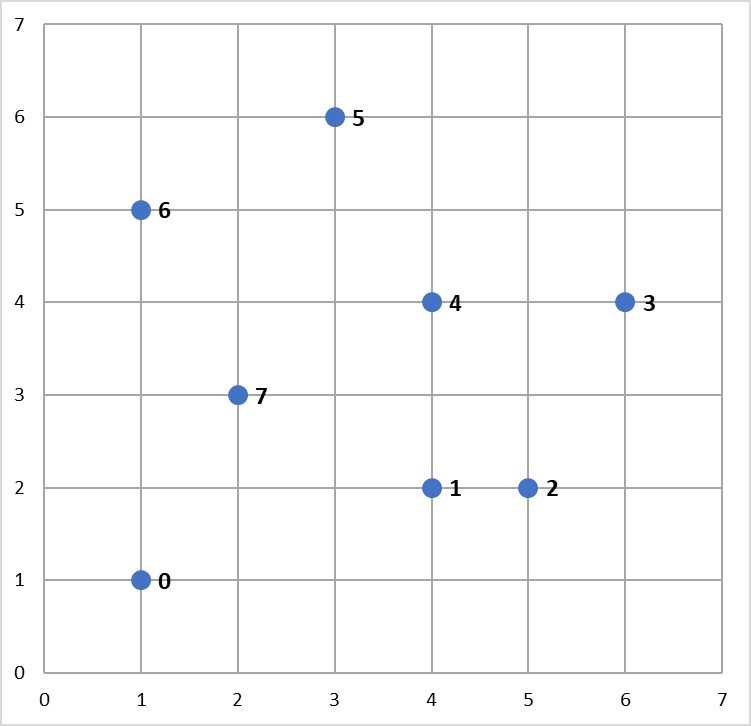
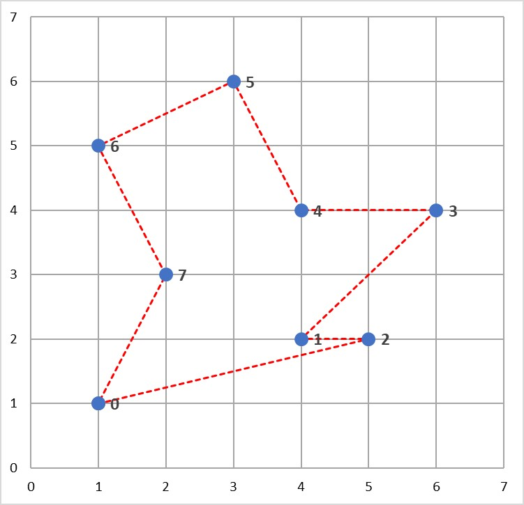
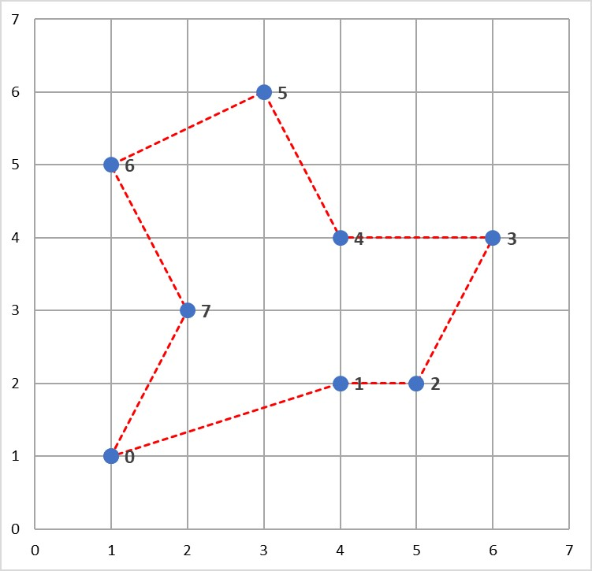

.. _tutorial2:

Tutorial - Travelling Saleperson Problems
=========================================

What is a Travelling Salesperson Problem?
-----------------------------------------
The travelling salesperson problem (TSP) is a classic optimization problem where the goal is to determine the shortest tour of a collection of n "cities" (i.e. nodes), starting and ending in the same city and visiting all of the other cities exactly once. In such a situation, a solution can be represented by a vector of n integers, each in the range 0 to n-1, specifying the order in which the cities should be visited.

TSP is an NP-hard problem, meaning that, for larger values of n, it is not feasible to evaluate every possible problem solution within a reasonable period of time. Consequently, TSPs are well suited to solving using randomized optimization algorithms. 

**Example**

Consider the following map containing 8 cities, numbered 0 to 7. 

A salesperson would like to travel to each of these cities, starting and ending in the same city and visiting each of the other cities exactly once.

One possible tour of the cities is illustrated below, and could be represented by the solution vector :math:`x = [0, 4, 2, 6, 5, 3, 7, 1]` (assuming the tour starts and ends at City 0).

.. image:: pictures/tsp2.jpg
   :width: 500px
   :height: 500px
   :alt: tsp example 2
   :align: center

However, this is not the shortest tour of these cities. The aim of this problem is to find the *shortest* tour of the 8 cities.

Solving TSPs with mlrose
------------------------
Given the solution to the TSP can be represented by a vector of integers in the range 0 to n-1, we could define a discrete-state optimization problem object and use one of mlrose's randomized optimization algorithms to solve it, as we did for the 8-Queens problem in the previous tutorial. However, by defining the problem this way, we would end up potentially considering invalid "solutions", which involve us visiting some cities more than once and some not at all.

An alternative is to define an optimization problem object that only allows us to consider valid tours of the n cities as potential solutions. This is a much more efficient approach to solving TSPs and can be implemented in mlrose using the :code:`TSPOpt()` optimization problem class.

In this tutorial, we will use this alternative approach to solve the TSP example given above. 

The steps required to solve this problem are the same as those used to solve any optimization problem in mlrose. Specificially:

1. Define a fitness function object.
2. Define an optimization problem object.
3. Select and run a randomized optimization algorithm.

Before starting with the example, you will need to import the mlrose and Numpy Python packages.

.. highlight:: python
.. code-block:: python

	import mlrose
	import numpy as np
	
Define a Fitness Function Object
--------------------------------
For the TSP in the example, the goal is to find the shortest tour of the eight cities. As a result, the fitness function should calculate the total length of a given tour. This is the fitness definition used in mlrose's pre-defined :code:`TravellingSales()` class.

The :code:`TSPOpt()` optimization problem class assumes, by default, that the :code:`TravellingSales()` class is used to define the fitness function for a TSP. As a result, if the  :code:`TravellingSales()` class is to be used to define the fitness function object, then this step can be skipped. However, it is also possible to manually define the fitness function object, if so desired.

To initialize a fitness function object for the :code:`TravellingSales()` class, it is necessary to specify either the (x, y) coordinates of all the cities or the distances between each pair of cities for which travel is possible. If the former is specified, then it is assumed that travel between each pair of cities is possible.

If we choose to specify the coordinates, then these should be input as an ordered list of pairs (where pair i specifies the coordinates of city i), as follows:

.. highlight:: python
.. code-block:: python

    # Create list of city coordinates
    coords_list = [(1, 1), (4, 2), (5, 2), (6, 4), (4, 4), (3, 6), (1, 5), (2, 3)]

    # Initialize fitness function object using coords_list
    fitness_coords = mlrose.TravellingSales(coords = coords_list)

Alternatively, if we choose to specity the distances, then these should be input as a list of triples giving the distances, d, between all pairs of cities, u and v, for which travel is possible, with each triple in the form (u, v, d). The order in which the cities is specified does not matter (i.e., the distance between cities 1 and 2 is assumed to be the same as the distance between cities 2 and 1), and so each pair of cities need only be included in the list once. 

Using the distance approach, the fitness function object can be initialize as follows:

.. highlight:: python
.. code-block:: python

    # Create list of distances between pairs of cities
    dist_list = [(0, 1, 3.1623), (0, 2, 4.1231), (0, 3, 5.8310), (0, 4, 4.2426), \
                 (0, 5, 5.3852), (0, 6, 4.0000), (0, 7, 2.2361), (1, 2, 1.0000), \
                 (1, 3, 2.8284), (1, 4, 2.0000), (1, 5, 4.1231), (1, 6, 4.2426), \
                 (1, 7, 2.2361), (2, 3, 2.2361), (2, 4, 2.2361), (2, 5, 4.4721), \
                 (2, 6, 5.0000), (2, 7, 3.1623), (3, 4, 2.0000), (3, 5, 3.6056), \
                 (3, 6, 5.0990), (3, 7, 4.1231), (4, 5, 2.2361), (4, 6, 3.1623), \
                 (4, 7, 2.2361), (5, 6, 2.2361), (5, 7, 3.1623), (6, 7, 2.2361)]

    # Initialize fitness function object using dist_list
    fitness_dists = mlrose.TravellingSales(distances = dist_list)

If both a list of coordinates and a list of distances are specified in initializing the fitness function object, then the distance list will be ignored.

Define an Optimization Problem Object
-------------------------------------
As mentioned previously, the most efficient approach to solving a TSP in mlrose is to define the optimization problem object using the :code:`TSPOpt()` optimization problem class.

If a fitness function has already been manually defined, as demonstrated in the previous step, then the only additional information required to initialize a :code:`TSPOpt()` object are the length of the problem (i.e. the number of cities to be visited on the tour) and whether our problem is a maximization or a minimization problem.

In our example, we want to solve a minimization problem of length 8. If we use the :code:`fitness_coords` fitness function defined above, we can define an optimization problem object as follows:

.. highlight:: python
.. code-block:: python

    # Define optimization problem object
    problem_fit = mlrose.TSPOpt(length = 8, fitness_fn = fitness_coords, maximize=False)

Alternatively, if we had not previously defined a fitness function (and we wish to use the :code:`TravellingSales()` class to define the fitness function), then this can be done as part of the optimization problem object initialization step by specifying either a list of coordinates or a list of distances, instead of a fitness function object, similar to what was done when manually initializing the fitness function object.

In the case of our example, if we choose to specify a list of coordinates, in place of a fitness function object, we can initialize our optimization problem object as:

.. highlight:: python
.. code-block:: python

    # Create list of city coordinates
    coords_list = [(1, 1), (4, 2), (5, 2), (6, 4), (4, 4), (3, 6), (1, 5), (2, 3)]

    # Define optimization problem object
    problem_no_fit = mlrose.TSPOpt(length = 8, coords = coords_list, maximize=False)
	
As with manually defining the fitness function object, if both a list of coordinates and a list of distances are specified in initializing the optimization problem object, then the distance list will be ignored. Furthermore, if a fitness function object is specified in addition to a list of coordinates and/or a list of distances, then the list of coordinates/distances will be ignored.

Select and Run a Randomized Optimization Algorithm
--------------------------------------------------
Once the optimization object is defined, all that is left to do is to select a randomized optimization algorithm and use it to solve our problem. 

This time, suppose we wish to use the genetic algorithms with the default parameter settings of a population size (pop_size) of 200, a mutation probability (mutation_prob) of 0.1, a maximum of 10 attempts per step (max_attempts) and no limit on the maximum total number of iteration of the algorithm (max_iters). This returns the following solution:

.. highlight:: python
.. code-block:: python
	
    # Set random seed
    np.random.seed(2)
	
    # Solve problem using the genetic algorithm
    best_state, best_fitness = mlrose.genetic_alg(problem_fit)

    print(best_state)
    [1 3 4 5 6 7 0 2]

    print(best_fitness)
    18.8958046604

The solution tour found by the algorithm is pictured below and has a total length of 18.896 units.

As in the 8-Queens example given in the previous tutorial, this solution can potentially be improved on by tuning the parameters of the optimization algorithm. For example, increasing the maximum number of attempts per step to 100 and increasing the mutation probability to 0.2, yields a tour with a total length of 17.343 units.

.. highlight:: python
.. code-block:: python
	
    # Set random seed
    np.random.seed(2)
	
    # Solve problem using the genetic algorithm
    best_state, best_fitness = mlrose.genetic_alg(problem_fit, mutation_prob = 0.2, max_attempts = 100)

    print(best_state)
    [7 6 5 4 3 2 1 0]

    print(best_fitness)
    17.3426175477
	
This solution is illustrated below and can be shown to be the optimal solution to this problem.

Summary
-------
In this tutorial we introduced the travelling salesperson problem, and discussed how mlrose can be used to efficiently solve this problem. This is an example of how mlrose caters to solving one very specific type of optimization problem. 

Another very specific type of optimization problem mlrose caters to solving is the machine learning weight optimization problem. That is, the problem of finding the optimal weights for machine learning models such as neural networks and regression models. We will discuss how mlrose can be used to solve this problem next, in our third and final tutorial.